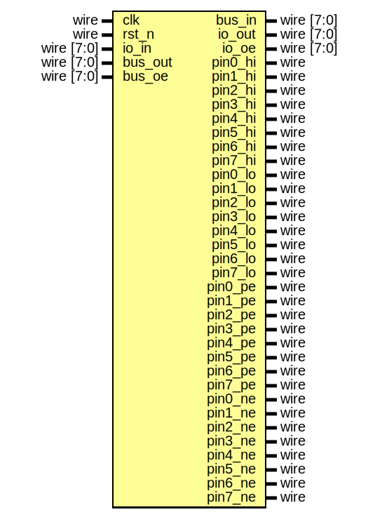

# EF_GPIO8

A generic 8-bit General Purpose I/O (GPIO) Peripheral with the following features

- Eight bidirectional pins.
- Input synchronizers
- Input edge detectors.
- Direction control.
- Edge and Level Interrupts generation per pin.
- Wrappers for AHB-Lite, APB and WB buses.

## The wrapped IP


 APB and AHBL wrappers, generated by the [BusWrap](https://github.com/efabless/BusWrap/tree/main) `bus_wrap.py` utility, are provided. WB wrapper will be provided soon. All wrappers provide the same programmer's interface as outlined in the following sections.

### Wrapped IP System Integration

Based on your use case, use one of the provided wrappers or create a wrapper for your system bus type. For an example of how to integrate the APB wrapper:
```verilog
EF_GPIO8_APB INST (
        `TB_APB_SLAVE_CONN,
        .io_in(io_in),
        .io_out(io_out),
        .io_oe(io_oe)
);
```
> **_NOTE:_** `TB_APB_SLAVE_CONN is a convenient macro provided by [BusWrap](https://github.com/efabless/BusWrap/tree/main).

## Implementation example  

The following table is the result for implementing the EF_GPIO8 IP with different wrappers using Sky130 PDK and [OpenLane2](https://github.com/efabless/openlane2) flow.
|Module | Number of cells | Max. freq |
|---|---|---|
|EF_GPIO8|72|1666 MHz|
|EF_GPIO8_APB|476|1250 MHz|
|EF_GPIO8_AHBL|493|294 MHz|

## The Programming Interface

### Registers

|Name|Offset|Reset Value|Access Mode|Description|
|---|---|---|---|---|
|DATAI|0000|0x00000000|r|Data In Register; Reading from this register returns the pins status (8 pins); one bit per pin|
|DATAO|0004|0x00000000|w|Data Out Register; Writing to this register change the status of the port pins (8 pins); one bit per pin|
|DIR|0008|0x00000000|w|Direction Register; One bit per pin 1: output, 0: input|
|IM|0f00|0x00000000|w|Interrupt Mask Register; write 1/0 to enable/disable interrupts; check the interrupt flags table for more details|
|RIS|0f08|0x00000000|w|Raw Interrupt Status; reflects the current interrupts status;check the interrupt flags table for more details|
|MIS|0f04|0x00000000|w|Masked Interrupt Status; On a read, this register gives the current masked status value of the corresponding interrupt. A write has no effect; check the interrupt flags table for more details|
|IC|0f0c|0x00000000|w|Interrupt Clear Register; On a write of 1, the corresponding interrupt (both raw interrupt and masked interrupt, if enabled) is cleared; check the interrupt flags table for more details|

### DATAI Register [Offset: 0x0, mode: r]

Data In Register; Reading from this register returns the pins status (8 pins); one bit per pin


### DATAO Register [Offset: 0x4, mode: w]

Data Out Register; Writing to this register change the status of the port pins (8 pins); one bit per pin


### DIR Register [Offset: 0x8, mode: w]

Direction Register; One bit per pin 1: output, 0: input


### Interrupt Flags

The wrapped IP provides four registers to deal with interrupts: IM, RIS, MIS and IC. These registers exist for all wrapper types generated by the [BusWrap](https://github.com/efabless/BusWrap/tree/main) `bus_wrap.py` utility. 

Each register has a group of bits for the interrupt sources/flags.
- `IM`: is used to enable/disable inetrrupt sources.

- `RIS`: has the current interrupt status (interruot flags) whether they are enabled or diabled.

- `MIS`: is the result of masking (ANDing) RIS by IM.

- `IC`: is used to clear an inetrrupt flag.


The following are the bit definitions for the interrupt registers:

|Bit|Flag|Width|Description|
|---|---|---|---|
|0|P0HI|1|Pin 0 is high|
|1|P1HI|1|Pin 1 is high|
|2|P2HI|1|Pin 2 is high|
|3|P3HI|1|Pin 3 is high|
|4|P4HI|1|Pin 4 is high|
|5|P5HI|1|Pin 5 is high|
|6|P6HI|1|Pin 6 is high|
|7|P7HI|1|Pin 7 is high|
|8|P0LO|1|Pin 0 is low|
|9|P1LO|1|Pin 1 is low|
|10|P2LO|1|Pin 2 is low|
|11|P3LO|1|Pin 3 is low|
|12|P4LO|1|Pin 4 is low|
|13|P5LO|1|Pin 5 is low|
|14|P6LO|1|Pin 6 is low|
|15|P7LO|1|Pin 7 is low|
|16|P0PE|1|Pin 0 has observed a rising edge|
|17|P1PE|1|Pin 1 has observed a rising edge|
|18|P2PE|1|Pin 2 has observed a rising edge|
|19|P3PE|1|Pin 3 has observed a rising edge|
|20|P4PE|1|Pin 4 has observed a rising edge|
|21|P5PE|1|Pin 5 has observed a rising edge|
|22|P6PE|1|Pin 6 has observed a rising edge|
|23|P7PE|1|Pin 7 has observed a rising edge|
|24|P0NE|1|Pin 0 has observed a falling edge|
|25|P1NE|1|Pin 1 has observed a falling edge|
|26|P2NE|1|Pin 2 has observed a falling edge|
|27|P3NE|1|Pin 3 has observed a falling edge|
|28|P4NE|1|Pin 4 has observed a falling edge|
|29|P5NE|1|Pin 5 has observed a falling edge|
|30|P6NE|1|Pin 6 has observed a falling edge|
|31|P7NE|1|Pin 7 has observed a falling edge|

### The Interface 



#### Ports 

|Port|Direction|Width|Description|
|---|---|---|---|
|io_in|input|8|GPIOs input (external interface)|
|io_out|output|8|GPIOs output (external interface)|
|io_oe|output|8|GPIOs output enable (external interface)|
|bus_in|output|8|Synchronized GPIOs input connected to the bus (it drives the DATAI register)|
|bus_out|input|8|GPIOs output connected to the bus (it's driven by writing to DATAO register)|
|bus_oe|input|8|GPIOs output enable connected to the bus (it's driven by writing to DIR register)|
|pin0_hi|output|1|Pin 0 high flag|
|pin1_hi|output|1|Pin 1 high flag|
|pin2_hi|output|1|Pin 2 high flag|
|pin3_hi|output|1|Pin 3 high flag|
|pin4_hi|output|1|Pin 4 high flag|
|pin5_hi|output|1|Pin 5 high flag|
|pin6_hi|output|1|Pin 6 high flag|
|pin7_hi|output|1|Pin 7 high flag|
|pin0_lo|output|1|Pin 0 low flag|
|pin1_lo|output|1|Pin 1 low flag|
|pin2_lo|output|1|Pin 2 low flag|
|pin3_lo|output|1|Pin 3 low flag|
|pin4_lo|output|1|Pin 4 low flag|
|pin5_lo|output|1|Pin 5 low flag|
|pin6_lo|output|1|Pin 6 low flag|
|pin7_lo|output|1|Pin 7 low flag|
|pin0_pe|output|1|Pin 0 positive edge flag|
|pin1_pe|output|1|Pin 1 positive edge flag|
|pin2_pe|output|1|Pin 2 positive edge flag|
|pin3_pe|output|1|Pin 3 positive edge flag|
|pin4_pe|output|1|Pin 4 positive edge flag|
|pin5_pe|output|1|Pin 5 positive edge flag|
|pin6_pe|output|1|Pin 6 positive edge flag|
|pin7_pe|output|1|Pin 7 positive edge flag|
|pin0_ne|output|1|Pin 0 negative edge flag|
|pin1_ne|output|1|Pin 1 negative edge flag|
|pin2_ne|output|1|Pin 2 negative edge flag|
|pin3_ne|output|1|Pin 3 negative edge flag|
|pin4_ne|output|1|Pin 4 negative edge flag|
|pin5_ne|output|1|Pin 5 negative edge flag|
|pin6_ne|output|1|Pin 6 negative edge flag|
|pin7_ne|output|1|Pin 7 negative edge flag|

## F/W Usage Guidelines:
1. Write to the direction register the direction of the GPIOs where 1 means gpio is output and 0 gpio is input
2. To drive a gpio pin, write to the ``DATAO`` register
3. To read the value of a gpio pin , read from the ``DATAI`` register 

## Installation:
You can either clone repo or use [IPM](https://github.com/efabless/IPM) which is an open-source IPs Package Manager
* To clone repo:
```git clone https://github.com/efabless/EF_GPIO8```
* To download via IPM , follow installation guides [here](https://github.com/efabless/IPM/blob/main/README.md) then run 
```ipm install EF_GPIO8```
## Simulation:
### Run Verilog Testbench:
1. Clone [IP_Utilities](https://github.com/shalan/IP_Utilities) repo in the same directory as the IP
2. In the directory ``EF_GPIO8/verify/utb/`` run ``make APB-RTL`` to run testbench for APB or ``make AHBL-RTL`` to run textbench for AHBL
### Run cocotb UVM Testbench:
In IP directory run:
 ```shell
 cd verify/uvm-python/
 ```
 ##### To run testbench for design with APB 
 To run all tests:
 ```shell
 make run_all_tests BUS_TYPE=APB
 ```
 To run a certain test:
 ```shell
 make run_<test_name> BUS_TYPE=APB
 ```
 To run all tests with a tag: 
 ```shell
 make run_all_tests TAG=<new_tag> BUS_TYPE=APB
 ```
 ##### To run testbench for design with APB
 To run all tests:
 ```shell
 make run_all_tests BUS_TYPE=AHB
 ```
 To run a certain test:
 ```shell
 make run_<test_name> BUS_TYPE=AHB
 ```
 To run all tests with a tag: 
 ```shell
 make run_all_tests TAG=<new_tag> BUS_TYPE=AHB
```
