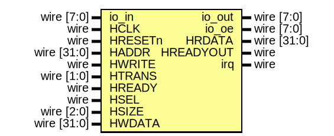

# EF_GPIO
A generic 8-bit GPIO port with the following features
- Eight bidirectional pins.
- Input synchronizers
- Input edge detectors.
- Direction control.
- Edge and Level Interrupts generation per pin.
- Wrappers for AHB-Lite, APB and WB buses.

## Registers
| Address | Size|Description |
| --------- | --|--------- |
|``0x00`` | 8|Data In Register   Reading from this register returns the pins status (8 pins); one bit per pin |
|``0x04`` |8|Data Out Register   Writing to this register change the status of the port pins (8 pins); one bit per pin |
|``0x08`` |8|Direction Register  One bit per pin 1: output, 0: input|
|``0xF00`` |32|Raw Interrupts Status (RIS) Register Reflects the status of interrupts trigger conditions detected (raw, before masking). |
|``0xF04`` |32|Masked Interrupts Status (MIS) Register Similar to RIS but shows the state of the interrupt after masking. MIS register is always RIS bitwise ANDed with IM. |
|``0xF08`` |32|Interrupts Mask (IM) Register Disabling/Enabling an interrupt source.|
|``0xF0C`` |32|Interrupt Clear (IC) Register  Writing a 1 to a bit in this register clears the corresponding interrupt state in the RIS Register. |

For RIS, MIS, IM and IC registers, the bit assignment is as follows:
| Bit | Interrupt Source|
| --- | --|
|0|Pin 0 is high |
|1|Pin 1 is high |
|.| |
|.| |
|.| |
|7|Pin 7 is high |
|8|Pin 0 is low |
|9|Pin 1 is low |
|.| |
|.| |
|.| |
|15|Pin 7 is low |
|16|Pin 0 has observed a rising edge |
|17|Pin 1 has observed a rising edge |
|.| |
|.| |
|.| |
|23|Pin 7 has a rising edge |
|24|Pin 0 has observed a falling edge |
|25|Pin 1 has observed a Falling edge |
|.| |
|.| |
|.| |
|31|Pin 7 has observed a Falling edge |

## EF_GPIo_ahbl Interface

